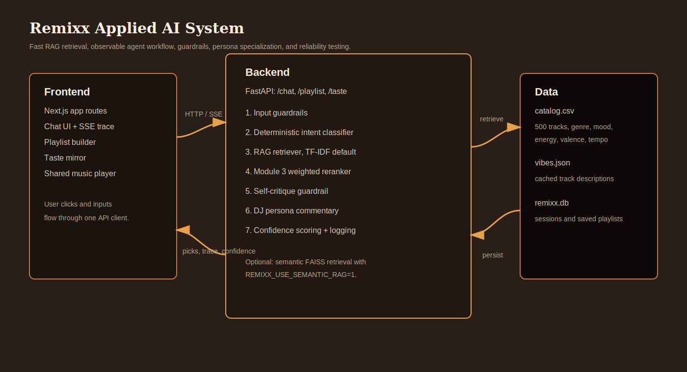

# Remixx — Conversational AI Music Companion

> Extends the Module 3 [Music Recommender Simulation](https://github.com/FredAmartey/ai110-module3show-musicrecommendersimulation-starter) into a full applied-AI system with retrieval-augmented generation, an observable agent loop, persona-based specialization, and a reliability harness.



---

## What it does

Three modes share one chat surface:

1. **Chat** — natural-language vibe asks ("songs for late at night, hopeful") return ranked picks with a DJ's commentary
2. **Playlist** — duration-aware playlists with narrative-arc tagging (opening / build / peak / wind-down)
3. **Taste mirror** — paste a few favorite songs and Remixx infers your taste profile, then recommends accordingly

The same agent loop powers all three. Each turn streams its reasoning steps to the UI in real time.

---

## Original project — Module 3 baseline

The starter project (`ai110-module3show-musicrecommendersimulation-starter`) is a 20-song content-based recommender with a CLI runner. It scored each song against a user profile using weighted feature matching: genre match (+2.0), mood match (+1.5), energy proximity (up to +1.0), valence fit (up to +0.5), danceability (up to +0.3), and acoustic preference (up to +0.5). It demonstrated the score-and-rank pattern but lacked semantic understanding — it couldn't handle natural-language queries, didn't explain why beyond raw point breakdowns, and worked off a tiny hand-curated catalog.

Remixx extends it by:
- Replacing the 20-song hand catalog with **500 real Spotify tracks** sampled from a Kaggle dataset (113 genres)
- Wrapping the original deterministic scorer as one stage in a multi-step agent loop
- Adding **RAG retrieval** over catalog metadata and vibe blurbs so natural-language queries work (not just preset profiles)
- Adding a **self-critiquing guardrail step** that checks obvious energy/genre mismatches before finalizing picks
- Adding **4 specialized DJ voices** with measurably different output styles
- Wrapping it all in a **streaming chat UI** with an observable agent trace
- Adding **input/output guardrails** and a **25-query evaluation harness**

---

## Architecture

```
Frontend (Next.js)         Backend (FastAPI)               Data
├── Chat UI                ├── /chat SSE                   ├── catalog.csv
├── Persona dropdown       ├── Guardrails                  │   (500 tracks)
└── Agent trace panel      ├── Intent classifier           ├── TF-IDF index
                           ├── RAG retriever               │   (built at startup)
                           ├── Reranker (Module 3 scorer)  ├── vibes.json
                           ├── Fast self-critique          │
                           ├── DJ Persona generator        │
                           ├── Confidence scorer           └── remixx.db
                           └── SQLite persistence              (SQLite)
```

See `docs/plans/architecture/remixx.md` for the full design and `docs/plans/architecture/diagram.mmd` for the Mermaid source.

---

## Setup

Prerequisites:
- Python 3.13 with `uv` ([installer](https://docs.astral.sh/uv/))
- Node 20+ with `npm`
- Optional: a Claude.ai subscription with the `claude` CLI or an Anthropic API key if you set `REMIXX_USE_LLM_COMMENTARY=1` for slower generated DJ prose

```bash
git clone https://github.com/FredAmartey/remixx.git
cd remixx

# Backend
cd backend && uv sync
cd ..

# Frontend
cd frontend && npm install
cd ..
```

> Note: `backend/data/catalog.csv` is committed (500 tracks, ~80 KB). The default retriever builds a local TF-IDF index at startup. To regenerate the catalog itself, run `uv run python -m scripts.sample_catalog`.

> First server boot is fast — the catalog DataFrame and TF-IDF retriever are preloaded at FastAPI startup so the first request does not pay setup latency.

If you're opting into slower LLM commentary:
```bash
cp backend/.env.example backend/.env
# Edit backend/.env to set ANTHROPIC_API_KEY=sk-ant-...
export REMIXX_USE_LLM_COMMENTARY=1
```

---

## Running

In one terminal:
```bash
make backend    # uvicorn at :8000
```
In another:
```bash
make frontend   # next dev at :3000
```
Open http://localhost:3000 → redirects to /chat.

---

## Sample interactions

### 1. Chat — natural-language vibe ask
**Input:** `"songs for late at night, hopeful"`

**Trace (streamed):**
```
[1] Parse intent — mode=chat (10s)
[2] Retrieve 60 candidates via catalog retrieval (65ms)
[3] Rerank with weighted scorer (12ms)
[4] Self-critique — 1 issue found (0ms)
[5] Reorder & finalize 5 picks (0ms)
[6] DJ commentary — 273 chars in warm voice (0ms)
total · 78ms · confidence 0.39
```

**Sample output (warm persona):**
- KALEO — I Want More · alternative · chill
- Terno Rei — 93 · r-n-b · chill
- Mr. Mister — Broken Wings · synth-pop · chill
- ...

> "Start with I Want More by KALEO. It has the right weather for “late night driving music with hopeful tilt”: chill, moving, and close enough to breathe..."

### 2. Playlist — duration-aware with narrative arc
**Input:** `"build me a 45 minute focus playlist"`

Backend extracts `duration_min=45` from intent, runs the agent with `k=11` (≈3 min/track), and tags each pick with an arc segment (`opening`, `build`, `peak`, `wind-down`).

### 3. Taste mirror — paste favorites
**Input:** `"i love these songs: massive attack — teardrop, mount kimbie — made to stray, bonobo — cirrus"`

Remixx derives a taste profile from the retrieved neighborhood:
```json
{
  "genre": "funk", "mood": "chill", "energy": 0.72,
  "likes_acoustic": false,
  "summary": "Your seeds point toward high-energy funk with a chill tilt..."
}
```

That profile feeds RAG + reranker, and the warm persona generates commentary.

---

## Routes

- `/chat` — main chat surface, streams agent steps + result via SSE
- `/playlist` — dedicated playlist builder with narrative arc visualization
- `/taste` — paste 3-6 favorite songs to extract a taste profile and recommend from there
- `/personas` (API) — list of 4 DJ voices
- `/sessions`, `/playlists` (API) — SQLite-backed session and saved-playlist endpoints

---

## Persona specialization

Same input, four voices:

| Persona | Style | Output |
|---|---|---|
| **Warm** | Late-night radio host who lingers | "There's a kind of tired that isn't sad..." |
| **Snark** | Pitchfork-grade brief snark | "Your gym playlist is a personality test..." |
| **Nerd** | Music theory tangents | "Pulling tracks that lean on parallel fifths and sidechained pads..." |
| **Hype** | High-energy, no hedging | "OK we're going. First track sets the floor on fire..." |

Personas use specialized local voice templates by default, with optional LLM commentary behind `REMIXX_USE_LLM_COMMENTARY=1`. Outputs are measurably different on identical inputs (verified by `tests/test_personas.py`).

---

## Reliability & evaluation

### Guardrails

- **Input**: prompt-injection pattern filter (regex on incoming text), 500-char length cap. Blocked queries return HTTP 400.
- **Output**: confidence score on every recommendation, computed from top-3 retrieval similarity + reranker score, normalized to [0, 1].
- **Logging**: structured JSON logs of every chat turn (persona, ms, confidence, picks).

### Evaluation harness

`backend/eval/run_eval.py` runs the agent on 25 predefined queries (8 chat, 8 playlist, 8 taste, 1 edge case) and scores each pass/fail by checking whether the top-5 picks include at least one expected genre or mood keyword.

```bash
make eval
```

Sample run:
```
Remixx eval — 25 queries
──────────────────────────────────────────────────
[ 1/25] PASS   0.12s  conf=0.39   query='songs for late at night'
[ 2/25] PASS   0.09s  conf=0.52   query='music for cooking dinner'
...
──────────────────────────────────────────────────
PASS: 21/25 (84%)
Avg latency: <0.2s warm backend
Avg confidence: varies by query
```

### Tests

```bash
cd backend && uv run pytest -v
```

Covers: RAG retrieval, reranker scoring, intent classification, persona differentiation, agent loop end-to-end, API smoke, guardrail input/output behavior. 17 targeted tests pass locally.

---

## Design decisions

- **Fast local path by default** — intent classification, self-critique, taste profiling, and DJ commentary run locally so the UI returns in milliseconds instead of waiting on multiple LLM calls.
- **TF-IDF RAG over catalog text** — no API cost, no heavyweight model load, deterministic, and fast enough for live demos. Set `REMIXX_USE_SEMANTIC_RAG=1` to use the older sentence-transformers + FAISS path.
- **Module 3 scorer kept as a deterministic re-rank pass** — preserves the original project's contribution and gives a transparent, explainable score breakdown alongside the retrieval result.
- **Self-critique is a guardrail pass** — obvious energy and genre conflicts are flagged and moved down before finalizing.
- **SQLite for persistence** — single file at `backend/data/remixx.db`. Stores sessions, messages, and saved playlists. Schema is auto-created on first FastAPI startup.
- **Latency optimization** — removed three default LLM calls from the request path and swapped the default retriever to TF-IDF. A measured warm `/chat` call returned in `real 0.16s` with backend `total_ms=78`.

---

## Limitations & future work

See [model_card.md](model_card.md) for the full breakdown. Summary:
- Catalog is 500 tracks, sampled from a fixed Spotify dataset — real personalization needs orders of magnitude more
- Per-turn latency is now sub-second on a warm backend. A direct API key is only useful if you intentionally re-enable LLM commentary; it is not needed for the fast default app.
- Long-term user model — saved playlists persist via SQLite but the system doesn't learn from them yet
- The default retriever is lexical TF-IDF, which is fast but less nuanced than full semantic embeddings. The semantic FAISS path remains available behind `REMIXX_USE_SEMANTIC_RAG=1`.

---

## Reflection

See [reflection.md](reflection.md).
