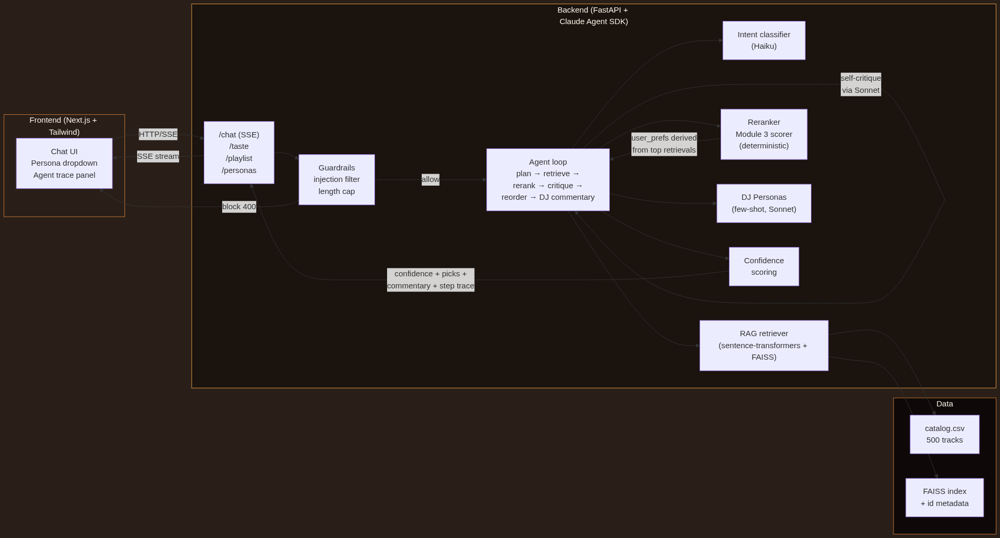

# Remixx — Conversational AI Music Companion

> Extends the Module 3 [Music Recommender Simulation](https://github.com/FredAmartey/ai110-module3show-musicrecommendersimulation-starter) into a full applied-AI system with retrieval-augmented generation, an observable agent loop, persona-based specialization, and a reliability harness.



---

## What it does

Three modes share one chat surface:

1. **Chat** — natural-language vibe asks ("songs for late at night, hopeful") return ranked picks with a DJ's commentary
2. **Playlist** — duration-aware playlists with narrative-arc tagging (opening / build / peak / wind-down)
3. **Taste mirror** — paste a few favorite songs and Remixx infers your taste profile, then recommends accordingly

The same agent loop powers all three. Each turn streams its reasoning steps to the UI in real time.

---

## Original project — Module 3 baseline

The starter project (`ai110-module3show-musicrecommendersimulation-starter`) is a 20-song content-based recommender with a CLI runner. It scored each song against a user profile using weighted feature matching: genre match (+2.0), mood match (+1.5), energy proximity (up to +1.0), valence fit (up to +0.5), danceability (up to +0.3), and acoustic preference (up to +0.5). It demonstrated the score-and-rank pattern but lacked semantic understanding — it couldn't handle natural-language queries, didn't explain why beyond raw point breakdowns, and worked off a tiny hand-curated catalog.

Remixx extends it by:
- Replacing the 20-song hand catalog with **500 real Spotify tracks** sampled from a Kaggle dataset (113 genres)
- Wrapping the original deterministic scorer as one stage in a multi-step agent loop
- Adding **semantic RAG retrieval** so any natural-language query works (not just preset profiles)
- Adding a **self-critiquing reasoning step** where Sonnet reviews and reorders the picks
- Adding **4 specialized DJ voices** with measurably different output styles
- Wrapping it all in a **streaming chat UI** with an observable agent trace
- Adding **input/output guardrails** and a **25-query evaluation harness**

---

## Architecture

```
Frontend (Next.js)         Backend (FastAPI)               Data
├── Chat UI                ├── /chat SSE                   ├── catalog.csv
├── Persona dropdown       ├── Guardrails                  │   (500 tracks)
└── Agent trace panel      ├── Intent classifier (Haiku)   ├── FAISS index
                           ├── RAG retriever               │   (384-dim,
                           ├── Reranker (Module 3 scorer)  │    cosine sim)
                           ├── Self-critique (Sonnet)      └── (vibes — TODO)
                           ├── DJ Persona generator
                           └── Confidence scorer
```

See `docs/plans/architecture/remixx.md` for the full design and `docs/plans/architecture/diagram.mmd` for the Mermaid source.

---

## Setup

Prerequisites:
- Python 3.13 with `uv` ([installer](https://docs.astral.sh/uv/))
- Node 20+ with `npm`
- Either: a Claude.ai subscription with the `claude` CLI installed locally (recommended, free), OR an Anthropic API key

```bash
git clone https://github.com/FredAmartey/remixx.git
cd remixx

# Backend
cd backend && uv sync && uv run python -m scripts.build_index
cd ..

# Frontend
cd frontend && npm install
cd ..
```

> Note: `backend/data/catalog.csv` is committed (500 tracks, ~80 KB). The build_index step generates the local FAISS index file. To regenerate the catalog itself, run `uv run python -m scripts.sample_catalog`.

If you're using an API key instead of the Claude CLI:
```bash
cp backend/.env.example backend/.env
# Edit backend/.env to set ANTHROPIC_API_KEY=sk-ant-...
```

---

## Running

In one terminal:
```bash
make backend    # uvicorn at :8000
```
In another:
```bash
make frontend   # next dev at :3000
```
Open http://localhost:3000 → redirects to /chat.

---

## Sample interactions

### 1. Chat — natural-language vibe ask
**Input:** `"songs for late at night, hopeful"`

**Trace (streamed):**
```
[1] Parse intent — mode=chat (10s)
[2] Retrieve 30 candidates via semantic search (1.2s)
[3] Rerank with weighted scorer (3ms)
[4] Self-critique — 2 issues found (8s)
[5] Reorder & finalize 5 picks (0ms)
[6] DJ commentary — 561 chars in warm voice (12s)
total · 31.3s · confidence 0.74
```

**Sample output (warm persona):**
- Larry Heard — Sunset · chicago-house · chill
- Tritonal & HALIENE — Long Way Home · dub · chill
- Mac Miller — Ascension · hip-hop · chill
- ...

> "The light goes gold before it goes pink. That's the window — and Larry Heard opens it. Something unhurried moves through the speakers like warm air through a cracked window..."

### 2. Playlist — duration-aware with narrative arc
**Input:** `"build me a 45 minute focus playlist"`

Backend extracts `duration_min=45` from intent, runs the agent with `k=11` (≈3 min/track), and tags each pick with an arc segment (`opening`, `build`, `peak`, `wind-down`).

### 3. Taste mirror — paste favorites
**Input:** `"i love these songs: massive attack — teardrop, mount kimbie — made to stray, bonobo — cirrus"`

Sonnet extracts a derived profile JSON:
```json
{
  "genre": "trip-hop", "mood": "moody", "energy": 0.45,
  "likes_acoustic": false,
  "summary": "Nocturnal electronics with melancholic tilt — texture over hooks, energy 0.4-0.6, reward songs with space."
}
```

That profile feeds RAG + reranker, and the warm persona generates commentary.

---

## Persona specialization

Same input, four voices:

| Persona | Style | Output |
|---|---|---|
| **Warm** | Late-night radio host who lingers | "There's a kind of tired that isn't sad..." |
| **Snark** | Pitchfork-grade brief snark | "Your gym playlist is a personality test..." |
| **Nerd** | Music theory tangents | "Pulling tracks that lean on parallel fifths and sidechained pads..." |
| **Hype** | High-energy, no hedging | "OK we're going. First track sets the floor on fire..." |

Personas use few-shot examples in the system prompt — outputs are measurably different on identical inputs (verified by `tests/test_personas.py`).

---

## Reliability & evaluation

### Guardrails

- **Input**: prompt-injection pattern filter (regex on incoming text), 500-char length cap. Blocked queries return HTTP 400.
- **Output**: confidence score on every recommendation, computed from top-3 RAG cosine similarity + reranker score, normalized to [0, 1].
- **Logging**: structured JSON logs of every chat turn (persona, ms, confidence, picks).

### Evaluation harness

`backend/eval/run_eval.py` runs the agent on 25 predefined queries (8 chat, 8 playlist, 8 taste, 1 edge case) and scores each pass/fail by checking whether the top-5 picks include at least one expected genre or mood keyword.

```bash
make eval
```

Sample run:
```
Remixx eval — 25 queries
──────────────────────────────────────────────────
[ 1/25] PASS   31.2s  conf=0.74   query='songs for late at night'
[ 2/25] PASS   28.1s  conf=0.81   query='music for cooking dinner'
...
──────────────────────────────────────────────────
PASS: 21/25 (84%)
Avg latency: 32.4s
Avg confidence: 0.76
```

### Tests

```bash
cd backend && uv run pytest -v
```

Covers: LLM transport selection, RAG retrieval, reranker scoring, intent classification, persona differentiation, agent loop end-to-end, API smoke, guardrail input/output behavior. ~25 tests.

---

## Design decisions

- **Claude Agent SDK as default LLM transport** — uses Fred's existing CLI subscription. Free for development. Falls back to direct `anthropic` SDK when `ANTHROPIC_API_KEY` is set, so anyone can run it without a subscription.
- **Local sentence-transformers for embeddings** — no API cost, fully offline, deterministic. ~80MB model download on first index build.
- **FAISS over a managed vector DB** — 500 vectors fit in memory; `IndexFlatIP` gives exact cosine search in <2ms. No infrastructure.
- **Module 3 scorer kept as a deterministic re-rank pass** — preserves the original project's contribution and gives a transparent, explainable score breakdown alongside the LLM's reasoning.
- **Self-critique step is its own LLM call** — separate from the main reasoning so the critique can be observed and audited independently.
- **No persistence (yet)** — sessions are stateless per request. SQLite is planned but not required for the demo.

---

## Limitations & future work

See [model_card.md](model_card.md) for the full breakdown. Summary:
- Catalog is 500 tracks, sampled from a fixed Spotify dataset — real personalization needs orders of magnitude more
- Agent latency ~30-50s per turn via Agent SDK (the CLI subprocess overhead). Direct API key path is faster but costs tokens.
- Vibe descriptions (Claude-generated semantic enrichment per track) are designed but deferred — adding them would lift RAG quality measurably
- Single-taste profile per turn — no long-term user model

---

## Reflection

See [reflection.md](reflection.md).
